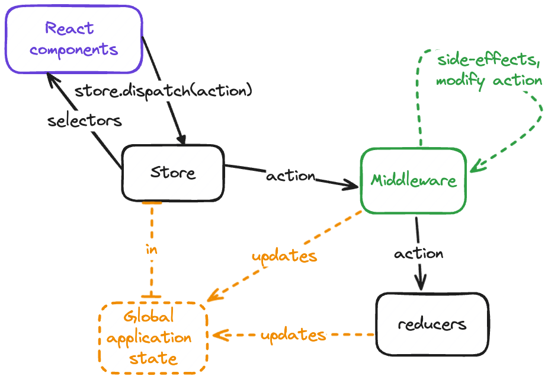

Why do you want to master Redux in 2024 and beyond?

1. Redux teaches you clean code patterns that refine how you will architect your future apps or servers.
2. While you might not need it in a brand new Next.js or Remix app, Redux is still the most used state management library by a large margin. That makes it very valuable for your future job opportunities.
   - https://npmtrends.com/@reduxjs/toolkit-vs-mobx-vs-react-query-vs-react-redux-vs-recoil-vs-redux-vs-swr-vs-zustand

I've built Redux apps that scaled to hundreds of thousands of concurrent users. And in this video, I'm going to share with you the lessons I learned.

If you're a beginner, this video will teach you Redux from the ground up.

And even if you've been using Redux for years, this video will fill any gaps in your knowledge and reveal secret tricks for writing the cleanest code possible.

This video is part of a 5-part series on Redux. The first three together will give you a deeper understanding than 98% of the market. And the last two are tutorials where you build production-ready Redux apps. In the description you can find a playlist with all 5 videos.

Most developers often start with two key questions:

- "Why Redux?", or "Why did it become so popular?", and then
- "Why did it fall off?"

You're going to get the answer to these questions at the end of the video because to fully understand them, you need to understand Redux.

Instead you're going to start with answering the question ...

# Redux' Components

What is Redux?

Redux is a JavaScript library for managing application state. Redux makes it easier to handle complex state in large applications by using a single, global store, which contains the applications state.

The name "Redux" derives from the array method "reduce" mixed with the "Flux" architecture.

The `reduce` part refers to the reducer functions in Redux that manage changes to your application’s state.

And the Flux architecture is an old data flow model, which you'll learn soon.

Redux is made out of 6 building blocks:

1. **Actions**: An action is a plain JavaScript object that describes what happened and carries data in your application.
2. **Reducers**: A reducer is a pure function that determines how the application's state changes in response to actions.
3. **Store**: The store holds the whole state tree of your application.
4. **Dispatch**: Dispatch is a method used to send actions to the store to update state.
5. **Selectors**: Selectors are pure functions that allow you to extract and compute derived data from the store.
6. **Middleware**: Middleware lets you extend Redux with custom functionality, handling processes like asynchronous actions or logging.

# Redux Data Flow

This diagram shows you the data flow in Redux and how these 6 components work together.



Your React components have access to your store's `dispatch`method. You'll learn how this works later in the video.

You then dispatch an action which get's passed to your middleware for processing and handling side-effects before reaching your reducers.

Your reducers update the global application state.

The updated state flows back into your React components through your selectors, triggering a re-render.

# Project Setup

This video will contain many code examples, and I highly recommend you code along because that way you will retain the most knowledge.

So create a new Next.js 15 project.

```sh
npx create-next-app@latest
```

And then configure your project by hitting `yes` on everything except TypeScript. The third video in this series covers Redux with TypeScript.

```sh
✔ **What is your project named?** … redux-mastery-part-one
✔ **Would you like to use** **TypeScript****?** … No / Yes
No
✔ **Would you like to use** **ESLint****?** … No / Yes
Yes
✔ **Would you like to use** **Tailwind CSS****?** … No / Yes
Yes
✔ **Would you like to use** **`src/` directory****?** … No / Yes
Yes
✔ **Would you like to use** **App Router****? (recommended)** … No / Yes
Yes
✔ **Would you like to customize the default** **import alias** **(@/*)?** … No / No
```

# `.reduce()`

You should know the basics of JavaScript like what an object is, what functions are and what the `.reduce()` array method is.

As a refresher, the `.reduce()` method in JavaScript processes each element in an array. It combines them into a single output value. The method takes a function as an argument. This function called the `reducer` function is applied to each element in the array.

Here's a basic example using `.reduce()` to sum up an array of numbers:

```js
const numbers = [1, 2, 3, 4];
const sum = numbers.reduce((total, current) => total + current, 0);
console.log(sum); // Output: 10
```

Every reducer functions takes in two parameters: the accumulator in this case called `total` and the current value.

If that was too fast or too much for you, watch this video that explains all of these things in-depth. It also prepares you for some advanced selector composition, which you will learn later in this. I linked for you in the description below.

Now let's break down all of the building blocks of a Redux. Starting with ...

# 1. Actions

Actions are the only way your application communicates with the store in Redux

```js
const actionWithoutPayload = { type: "some-string" };
const actionWithPayload = {
  type: "some-string",
  payload: { message: "I can be anything. In this case, I'm an object." },
};
```

Actions are plain JavaScript objects and must have a `type` property. The `type` indicates the action's purpose.

You can also pass additional data using the `payload` property. A `payload` can be data type in JavaScript.

```js
const saveSponsorAction = {
  type: "saveSponsor",
  payload: { company: "ReactSquad", offer: "Senior React Developers" },
};
```

`saveSponsorAction` shows you a more real-world example. You might see an action like this when someone saves some entity, in this case a sponsor. It contains the sponsor to be saved as the payload.

And this video is sponsored by my company ReactSquad. If your company needs help from senior React developers, visit ReactSquad.io and book your free consultation call now.

# 2. Reducers

The second building block are reducers.

Reducers are pure functions in Redux that take the current state and an action, and return a new state.

Create a file in `src/app/example.js`.

```js
const reducer = (state, action) => {
  switch (action.type) {
    case "INCREMENT": {
      return state + 1;
    }
    case "INCREMENT_BY": {
      return state + action.payload;
    }
    default:
      return state;
  }
};
```

`state` is the accumulator, and action is the current value. When you write `reducer`s, you usually use a `switch` statement which evaluates the action's `type`. In this example, the `reducer` function handles two action types:

- `"INCREMENT"` increases the state by one.
- `"INCREMENT_BY"` increases the state by the amount specified in the action's `payload`.

The `default` case returns the current state unchanged, which is important for handling any unknown actions.

Remember, reducers must be pure functions - that means:

- they do **_NOT_** modify the inputs,
- perform side effects like API calls, or
- call non-pure functions like `Date.now()` or `Math.random()`.

And make sure that each case uses the `return` statement to prevent any case from falling through.

---

**NOTE for Cheta:** Please record "the difference" for these following code examples. Basically, edit the file of the previous take of the `reducer` with the new changes, so we don't always code up everything from scratch. You can use an online diff checker to see what changed between the examples, so you won't miss anything.

And for the next code example, please add the actions line by line to the array.

---

```js
const reducer = (state, action) => {
  switch (action.type) {
    case "INCREMENT": {
      return state + 1;
    }
    case "INCREMENT_BY": {
      return state + action.payload;
    }
    default:
      return state;
  }
};

const actions = [
  { type: "INCREMENT" },
  { type: "INCREMENT_BY", payload: 8958 },
  { type: "INCREMENT_BY", payload: 41 },
  { type: "INCREMENT" },
];

const state = actions.reduce(reducer, 0);
console.log("state", state); // state 9001
```

To user your `reducer` you can create an array of actions, which lists the actions to process. Notice how only the `'INCREMENT_BY'` action has a payload.

Now you can reduce over your actions, passing in your `reducer` as the reducer function and `0` as the initial value for the `state`. The result is 9001. This usage example visualizes where the `reducer` part of the name in Redux comes from.

---

**Note to Cheta:** Please also show running all of these examples (including the one above and the raw "store" examples later) in the console. You can use the following command. `tsx` will handle the `import` statements and other modern syntax in later code examples for you:

```sh
$ npx tsx src/app/example.js
state 9001
```

Once React gets involved, please also record the browser and interact with the code examples, where applicable.

---

```js
const initialState = 0;

const reducer = (state = initialState, action) => {
  switch (action.type) {
    case "INCREMENT": {
      return state + 1;
    }
    case "INCREMENT_BY": {
      return state + action.payload;
    }
    case "RESET": {
      return initialState;
    }
    default:
      return state;
  }
};

const actions = [
  { type: "INCREMENT" },
  { type: "INCREMENT_BY", payload: 8958 },
  { type: "RESET" },
  { type: "INCREMENT_BY", payload: 41 },
  { type: "INCREMENT" },
];

const state = actions.reduce(reducer, initialState);
console.log("state", state); // state 42
```

Capture the initial state in its own variable to improve the code.

This lets you easily use default parameters for the initial state and add a new action to reset the reducer to its initial state.

You can test it, by adding it to your actions array. And instead of hardcoding 0, you can pass the initial state to the `reduce` method. This prevents errors if you ever change the initial state. Now the result is 42.

But you can improve the code even more.

---

**Note to Cheta:** For this following example, please create each action creator line by line, and replace each action then later in the array line by line.

---

```js
const increment = () => ({ type: "INCREMENT" });
const incrementBy = (payload) => ({ type: "INCREMENT_BY", payload });
const reset = () => ({ type: "RESET" });

const initialState = 0;

const reducer = (state = initialState, action) => {
  switch (action.type) {
    case "INCREMENT": {
      return state + 1;
    }
    case "INCREMENT_BY": {
      return state + action.payload;
    }
    case "RESET": {
      return initialState;
    }
    default:
      return state;
  }
};

const actions = [
  increment(),
  incrementBy(8958),
  reset(),
  incrementBy(41),
  increment(),
];

const state = actions.reduce(reducer, initialState);
console.log("state", state); // state 42
```

Create factory functions for your actions. In Redux, these are known as "action creators". If an action needs a payload, pass it as a parameter to the action creator.

Replace the hardcoded actions in your array with calls to these action creators. You pass the numbers as arguments to the `icrementBy` action creators that need a payload.

After these refactors, the resulting `state` should remain the same.

Action creators have several benefits:

- Action creators **reduce boilerplate** by abstracting away the creation of the object and type, so you only focus on what action to call and it's payload.
- As factory functions, action creators allow you to **do calculations on input**. For example, you can provide default values through default parameters, which also gives you type inference for free, or use action creators to map values to their correct shape.

```js
// Default parameters
const addNeighbor = ({ fullName = "NA", joinDate = new Date() } = {}) => ({
  type: "addNeighbor",
  payload: { fullName, joinDate },
});

// Mapping values
const fetchedUser = ({ firstName, lastName }) => ({
  type: "fetchedUser",
  payload: { name: `${firstName} ${lastName}` },
});
```

- Action creators also **decrease bugs** by encapsulating the constants in your reducer file.

Can you clean this code up even more?

Yes you can. Now you'll learn some senior secrets on structuring your Redux code..

```js
export const increment = () => ({ type: "INCREMENT" });
export const incrementBy = (payload) => ({ type: "INCREMENT_BY", payload });
export const reset = () => ({ type: "RESET" });

export const slice = "example";

const initialState = { count: 0 };

export const reducer = (state = initialState, { type, payload } = {}) => {
  switch (type) {
    case increment().type: {
      return { ...state, count: state.count + 1 };
    }
    case incrementBy().type: {
      return { ...state, count: state.count + payload };
    }
    case reset().type: {
      return initialState;
    }
    default: {
      return state;
    }
  }
};

const actions = [
  increment(),
  incrementBy(8958),
  reset(),
  incrementBy(41),
  increment(),
];

const state = actions.reduce(reducer, reducer());
console.log("state", state); // state { count: 42 }
```

First of all, add a `slice`. This is nothing senior, yet, but a simple step that prepares your code for correct usage in your Next.js app. A "slice" refers to a specific portion of your application's state. Each slice is responsible for a distinct feature or domain within your app. It includes its own reducer, action creators, and selectors.

Next, destructure the `type` and `payload` of your action and default it to the empty object. Destructuring reduces the amount of code you need to write in your `switch` statement.

Also tightly couple your action creators directly to your switch cases by using the action creators' `.type` property instead of hardcoding strings. This approach prevents typos in action types and makes refactors easier because changes in your action types automatically propagate to your reducer.

To keep your `reducer` a pure function, you create new objects using the spread syntax instead of modifying the current state. Keeping your state immutable makes your state updates predictable and helps with efficient rendering updates.

Your refactor has one final benefit: when you call your reducer without arguments, it now returns the initial state. This makes sure that wherever you import your reducer and need its initial state, you don't need to import the initial state separately, reducing the risk of bugs.

# 3. Store

Next, you're going to learn about the third building block: the store. The store is a central place where your application's state lives and reducers and middleware are wired together.

Here is what an example implementation looks like. (Create a new file called `src/app/createStore.js`.)

```js
export function createStore(reducer, initialState) {
  let state = initialState;

  const getState = () => state;

  return { getState };
}
```

Your application's state will be encapsulated in the closure of the `createStore` function.

Then create a new file called `src/app/store.js` and import your `createStore` function.

```js
import { createStore } from "./create-store";
import { reducer } from "./example";

const store = createStore(reducer, reducer());

console.log("state", store.getState()); // state { count: 0 }
```

Use your `createStore` function to create your store. Calling the `reducer` without arguments provides the initial state, which is `{ count: 0 }` in this case. You can use `getState()` to access your store's current state.

The Redux package comes with it's own more sophisticated version of the `createStore` function, so install the `redux` package.

```sh
npm i redux
```

Then import the `createStore` function.

```js
import { legacy_createStore as createStore } from "redux";

import { reducer } from "./example";

const store = createStore(reducer, reducer());

console.log("state", store.getState()); // state { count: 0 }
```

You're going to use the `legacy_createStore` import because the regular `createStore` import is deprecated. It will keep working forever, but the maintainers of Redux deprecated it to nudge people to use Redux Toolkit, which you're going to learn in the third video of this series, so subscribe to this channel to get notified when that releases.

# 4. Dispatch

Now that you got your store, how do you send actions to it to manipulate it's state? You use a function called `dispatch` for that.

Go back to your own implementation of the `createStore` function and modify it to expose a `dispatch` method.

```js
export function createStore(reducer, initialState) {
  let state = initialState;

  const dispatch = (action) => {
    state = reducer(state, action);
  };

  const getState = () => state;

  return { dispatch, getState };
}
```

`dispatch` takes in an action and uses the `reducer` from your `createStore` function to calculate the next state, and then mutates the state in the closure.

The store created using the `createStore` function from Redux already has a `dispatch` method.

```js
import { legacy_createStore as createStore } from "redux";

import { increment, incrementBy, reducer, reset } from "./example";

const store = createStore(reducer, reducer());

const actions = [
  increment(),
  incrementBy(5),
  reset(),
  incrementBy(41),
  increment(),
];

for (const action of actions) {
  store.dispatch(action);
}

console.log("state", store.getState()); // state { count: 42 }
```

Define an array of actions using your actions from your example reducer. Then, use a `for` loop to dispatch each action to the store. After that, calling `getState()` will give you the current state of your store.

# Multiple Reducers

You've learned how to set up your store with a single reducer. But as mentioned earlier, Redux apps usually have many slices, each corresponding to a different feature or domain of your app. So, how do you handle multiple reducers in the same store?

To show this, create a user profile reducer in `src/app/user-profile.js`.

```js
export const loginSuccess = (payload) => ({ type: "LOGIN_SUCCESS", payload });
export const fetchedUsers = (payload) => ({ type: "FETCHED_USERS", payload });

export const slice = "userProfile";
const initialState = { currentUserId: null, users: {} };

export const reducer = (state = initialState, { type, payload } = {}) => {
  switch (type) {
    case loginSuccess().type: {
      return {
        ...state,
        currentUserId: payload.id,
        users: { ...state.users, [payload.id]: payload },
      };
    }
    case fetchedUsers().type: {
      const newUsers = { ...state.users };

      payload.forEach((user) => {
        newUsers[user.id] = user;
      });

      return { ...state, users: newUsers };
    }
    default: {
      return state;
    }
  }
};
```

Create two actions: one for when the user logs in and another for when a list of users is fetched.

You also want to normalize your state. This means that when a user is fetched, you're going to save them in an object, where the key is the user's `id`, and the value is the entire user object. This state shape prevents duplicates and will come in handy later when you learn about selectors.

Always create a new object when updating the users' object to maintain state immutability.

Notice that the action creators are named in the past tense - this is a good practice. This naming convention indicates what event just happened, making your app easier to debug. Some developers name their actions like a process, which makes debugging harder.

---

**Note to Cheta:** the following code should NOT go into the `userProfile` reducer. Create it in a new file. This code is only to illustrate the point of ambiguous action naming.

---

```js
const setCurrentUser = (payload) => ({ type: "SET_CURRENT_USER", payload }); // 🚫 Bad!
const loginSuccess = (payload) => ({ type: "LOGIN_SUCCESS", payload }); // ✅ Good!
const changedUser = (payload) => ({ type: "CHANGED_USER", payload }); // ✅ Good!
```

All three actions cause the same state change. When you see that the `setCurrentUser` action has been dispatched, you have no idea what just happened. But for `loginSuccess` and `changeUser` it's immediately clear what just happened.

```js
const setCurrentUser = (payload) => ({ type: "SET_CURRENT_USER", payload });
const loginSuccess = (payload) => ({ type: "LOGIN_SUCCESS", payload });
const changedUser = (payload) => ({ type: "CHANGED_USER", payload });

const changeCurrentUser = (state, currentUser) => ({
  ...state,
  currentUserId: currentUser.id,
  users: { ...state.users, [currentUser.id]: currentUser },
});

export const reducer = (state = initialState, { type, payload } = {}) => {
  switch (type) {
    case setCurrentUser().type: {
      return changeCurrentUser(state, payload);
    }
    case changedUser().type: {
      return changeCurrentUser(state, payload);
    }
    case loginSuccess().type: {
      return changeCurrentUser(state, payload);
    }
    // ... rest
  }
};
```

Avoid fall-through switch cases to prevent unwanted bugs. If multiple actions require the same state update, abstract that away in a helper function and use it in your reducer for multiple cases.

Now in your store, import each reducer's slice alongside the respective reducer.

```js
import { legacy_createStore as createStore } from "redux";

import { reducer as exampleReducer, slice as exampleSlice } from "./example";
import {
  reducer as userProfileReducer,
  slice as userProfileSlice,
} from "./user-profile";

function combineReducers(reducers) {
  return function rootReducer(state = {}, action = {}) {
    return Object.keys(reducers).reduce((nextState, slice) => {
      nextState[slice] = reducers[slice](state[slice], action);
      return nextState;
    }, {});
  };
}

const rootReducer = combineReducers({
  [exampleSlice]: exampleReducer,
  [userProfileSlice]: userProfileReducer,
});

const store = createStore(rootReducer, rootReducer());

console.log("state", store.getState());
// state {
//   example: { count: 0 },
//   userProfile: { currentUserId: null, users: {} }
// }
```

Then create a `combineReducer`s function. The function merges several smaller reducers into a single reducer that manages the overall application state, usually called the "root reducer". Each reducer passed to `combineReducers` handles its own part of the state, which is defined by their respective slice key.

When an action is dispatched, `combineReducers` calls each reducer with its current slice of the state and the action, then merges the results into a new state object.

Use your `combineReducers` function to create a root reducer and modify your store to use that root reducer.

When you call `getState()`, you can see each slice and its respective state in the store's current state.

Instead of creating your own `combineReducers` function, use the `combineReducers` function from the Redux package.

```js
import { combineReducers, legacy_createStore as createStore } from "redux";

import { reducer as exampleReducer, slice as exampleSlice } from "./example";
import {
  reducer as userProfileReducer,
  slice as userProfileSlice,
} from "./user-profile";

const rootReducer = combineReducers({
  [exampleSlice]: exampleReducer,
  [userProfileSlice]: userProfileReducer,
});

const store = createStore(rootReducer, rootReducer());

console.log("state", store.getState());
// state {
//   example: { count: 0 },
//   userProfile: { currentUserId: null, users: {} }
// }
```

# React Redux

Instead of interacting directly with your store from your UI code, Redux is commonly used with "UI binding" libraries.

For React there is React Redux, which is the official library maintained by the Redux team. React Redux has built-in performance optimizations to ensure your component only re-renders when necessary. Install it in your project.

```sh
npm i react-redux
```

In your `src/app/store.js`, create a `makeStore` function and get rid of your `store` object.

```js
import { combineReducers, legacy_createStore as createStore } from "redux";

import { reducer as exampleReducer, slice as exampleSlice } from "./example";
import {
  reducer as userProfileReducer,
  slice as userProfileSlice,
} from "./user-profile";

const rootReducer = combineReducers({
  [exampleSlice]: exampleReducer,
  [userProfileSlice]: userProfileReducer,
});

export const makeStore = () => {
  return createStore(rootReducer, rootReducer());
};
```

A Next.js server can handle multiple requests at once, so you need to create a new Redux store for each request and avoid sharing the store across requests. That is why you create the `makeStore` function instead of defining your `store` as a global variable. If you're NOT using Next.js with the `app/` directory, but are working on a regular Single Page Application (SPA), you can safely use a global `store` variable.

Create a provider for your store in `src/app/store-provider.js` and use the `makeStore()` function within it.

```jsx
"use client";
import { useRef } from "react";
import { Provider } from "react-redux";

import { makeStore } from "./store";

export function StoreProvider({ children }) {
  const storeRef = useRef();

  if (!storeRef.current) {
    storeRef.current = makeStore();
  }

  return <Provider store={storeRef.current}>{children}</Provider>;
}
```

Import the `Provider` from React Redux and your `makeStore` function.

Use a `ref` to ensure that the store is only created once. Although the component renders only once per server request, it might re-render multiple times on the client if stateful components are higher in the tree or if the component has mutable state that triggers re-renders.

Pass the `ref` of your store to the `Provider` from React Redux.

You want to use your `StoreProvider` anywhere in the component tree **above** where the store is used. In this tutorial, you're going put your provider on the root layout to make Redux available on every page.

Modify your root layout file in `src/app/layout.js`.

```jsx
import "./globals.css";

import { Inter } from "next/font/google";

import { StoreProvider } from "./store-provider";

const inter = Inter({ subsets: ["latin"] });

export const metadata = {
  title: "Jan Hesters Redux Tutorial",
  description: "Part one of three to master Redux.",
};

export default function RootLayout({ children }) {
  return (
    <StoreProvider>
      <html lang="en">
        <body className={inter.className}>{children}</body>
      </html>
    </StoreProvider>
  );
}
```

If you only want to use Redux on certain routes, you can use it on the respective page or route layout.

# 5. Selectors

How do you get data to your app? That's where selectors come in.

React Redux gives you two APIs to connect your components to Redux. You can either use hooks and HOCs.

## Hooks

You're first going to see the hooks API.

Create a file `src/app/hooks.js` which contains the Redux hooks.

```js
import { useDispatch, useSelector, useStore } from "react-redux";

export const useAppDispatch = useDispatch.withTypes();
export const useAppSelector = useSelector.withTypes();
export const useAppStore = useStore.withTypes();
```

If you want to use Redux' hooks, use these throughout your app instead of plain the `useDispatch` and `useSelector` hooks.

Modify your main `page.js` component to get the count from your state.

---

**Note to Cheta:** Here we should start recording and then showing the browser, too, for the code examples that change the UI, render new elements and components etc.

---

```jsx
"use client";

import { useAppSelector } from "./hooks";

export default function Home() {
  const count = useAppSelector((state) => state.example.count);

  return (
    <main className="flex min-h-screen flex-col items-center p-24">
      <h1 className="text-4xl font-bold">Redux Basics</h1>

      <div className="flex items-center justify-center space-x-4">
        <p className="text-2xl">Count: {count}</p>
      </div>
    </main>
  );
}
```

You'll have to use the `'use client'` directive here, too, because only client components have access to the Redux context. Keep in mind, since React Server Components cannot use hooks or context, you can't read or write from the Redux store within RSCs.

Now whenever the returned value from `useAppSelector` changes, the `Home` component will re-render.

However, it's important to understand that `useAppSelector` automatically memoizes its value. That means it only triggers a re-render if the selector's result is different than the last result based on a strict equality comparison (`===`) . You can check out "useCallback vs. useMemo" for an in-depth breakdown of how memoization works in React.

Even though the hook you use here is called `useAppSelector` or `useSelector`, strictly speaking you have **NOT** used a selector. Instead you hardcoded the accessing of your state.

A selector is a pure function that takes in the global state and returns an aggregated or derived value.

Create a `selectCount` selector in your `example.js` below your `reducer`.

```js
export const selectCount = (state) => state[slice].count;
```

Then use it your `Home` component.

```jsx
"use client";

import { selectCount } from "./example";
import { useAppDispatch } from "./hooks";

export default function Home() {
  const count = useAppSelector(selectCount);

  return (
    <main className="flex min-h-screen flex-col items-center p-24">
      <h1 className="text-4xl font-bold">Redux Basics</h1>

      <div className="flex items-center justify-center space-x-4">
        <p className="text-2xl">Count: {count}</p>
      </div>
    </main>
  );
}
```

You also need to modify your state. For that you need the `dispatch` function that you learned about earlier. You can get access to it inside of your React component by using the `useAppDispatch` function.

```jsx
"use client";

import { increment, selectCount } from "./example";
import { useAppDispatch, useAppSelector } from "./hooks";

export default function Home() {
  const count = useAppSelector(selectCount);
  const dispatch = useAppDispatch();

  return (
    <main className="flex min-h-screen flex-col items-center p-24">
      <h1 className="text-4xl font-bold">Redux Basics</h1>

      <div className="flex items-center justify-center space-x-4">
        <p className="text-2xl">Count: {count}</p>

        <button
          className="bg-white text-black hover:bg-white/90 inline-flex h-9 items-center justify-center whitespace-nowrap rounded-md px-4 py-2 text-sm font-medium shadow transition-colors"
          onClick={() => {
            dispatch(increment());
          }}
        >
          Increment
        </button>
      </div>
    </main>
  );
}
```

Then you can dispatch your action creator. In this example, you're going to dispatch the increment action when a user clicks a button. Clicking the button will update the state and then automatically change the `count` value that your component receives, which triggers a re-render and updates your UI in the browser.

## HOCs

The other way to connect your Redux store to your component is with higher-order components (HOC). A higher-order component is a function that takes in a component and returns a component. If you're unfamiliar with them, check out this video. The link is in the description.

The HOC that React Redux exposes is called `connect`.

The `connect` HOC works well with the display- / container-component pattern. If you're unfamiliar with it, this pattern organizes components into two categories.

Display- or dumb-components are pure functions that take in props and return JSX. They never contain any hooks, state, or lifecycle methods if you're using classes. It's fine if they contain simple ternaries or mappings.

Container- or smart-components are stateful and contain the logic. They can contain hooks, state or lifecycle methods in classes. Sometimes, when you use HOCs in container components, there is no JSX, which you will see later with Redux.

Create a display-component at `user-profile-component.js`.

```jsx
export const UserProfileComponent = ({ isLoggedIn, email, onLoginClicked }) => (
  <div className="flex items-center space-x-4">
    {isLoggedIn ? (
      <p className="text-2xl">Email: {email}</p>
    ) : (
      <button
        className="inline-flex h-9 items-center justify-center whitespace-nowrap rounded-md bg-white px-4 py-2 text-sm font-medium text-black shadow transition-colors hover:bg-white/90"
        onClick={() =>
          onLoginClicked({ id: "123", email: "jan@reactsquad.io" })
        }
      >
        Login
      </button>
    )}
  </div>
);
```

The component takes in a `isLoggedIn` boolean and renders the email for the logged in user, or a button that when clicked logs the user in.

Now add some new selectors to your `src/app/user-profile`.

```js
const selectUserProfileSlice = (state) => state[slice];

const selectCurrentUserId = (state) =>
  selectUserProfileSlice(state).currentUserId;

const selectUsers = (state) => selectUserProfileSlice(state).users;

export const selectCurrentUser = (state) => {
  const currentUserId = selectCurrentUserId(state);
  const users = selectUsers(state);

  return users[currentUserId];
};

export const selectCurrentUsersEmail = (state) =>
  selectCurrentUser(state)?.email || "";

export const selectIsLoggedIn = (state) => Boolean(selectCurrentUserId(state));
```

- **`selectUserProfileSlice`**: Retrieves the `userProfile` slice of the state.
- **`selectCurrentUserId`**: Gets the current user's ID from the `userProfile` slice.
- **`selectUsers`**: Returns the `users` object from the `userProfile` slice.
- **`selectCurrentUser`**: Retrieves the complete data of the current user. It takes advantage of the normalized users.
- **`selectCurrentUsersEmail`**: Returns the email address of the current user.
- **`selectIsLoggedIn`**: Checks if a user is logged in.

Now that you've seen a couple selectors, you can understand their benefits.

1. Selectors are facades that let you **avoid state-shape dependencies**.
2. Selectors are memoizeable.

### Selectors Avoid State-Shape Dependencies

A facade is a design pattern where you **provide a simplified interface to a complex subsystem**.

You have state shape dependencies when your code relies on a specific shape of state. A change in the state's shape can break the dependent code.

As you can see, your **selectors compose**, which is their key feature that allows them to abstract away state shape dependencies.

Currently, your state looks like this.

```json
{
  "userProfile": {
    "currentUsersId": "abc-123",
    "users": {
      "abc-123": {
        "id": "abc-123",
        "email": "johndoe@example.com"
      },
      "xyz-789": {
        "id": "xyz-789",
        "email": "janesmith@example.com"
      }
    }
  },
  "counter": {
    "count": 0
  }
}
```

Now imagine instead of using selectors, ...

```js
function UserProfileContainer() {
  const email = useAppSelector(selectCurrentUsersEmail);

  // ...
}
```

... you would inline the retrieval of the current user's email.

```js
function UserProfileContainer() {
  // selectCurrentUsersEmail selector inlined
  const email = useAppSelector(
    (state) =>
      state.userProfileSlice.users[state.userProfileSlice.currentUserId]
        ?.email || ""
  );

  // ...
}
```

And imagine further that for some reason you would need to refactor your state shape, so that instead of your users being normalized, they're now an array.

```json
{
  "userProfile": {
    "currentUsersId": "abc-123",
    "users": [
      {
        "id": "abc-123",
        "email": "johndoe@example.com"
      },
      {
        "id": "xyz-789",
        "email": "janesmith@example.com"
      }
    ]
  },
  "counter": {
    "count": 0
  }
}
```

Now you'd need to update your inlined selector.

```js
function UserProfileContainer() {
  // Update the selectCurrentUsersEmail selector to work with the new array structure.
  const email = useAppSelector((state) => {
    const users = state.userProfile.users;
    const currentUserId = state.userProfile.currentUsersId;
    const currentUser = users.find((user) => user.id === currentUserId);
    return currentUser?.email || "";
  });

  // ...
}
```

And you'd need to do this update **everywhere** you are using the users directly or for some derived state, such as the current user's email.

With selectors, you'd only need to update the `selectCurrentUser` selector. All other selectors could stay the same.

```js
const selectUserProfileSlice = (state) => state.userProfile;

const selectCurrentUserId = (state) =>
  selectUserProfileSlice(state).currentUsersId;

const selectUsers = (state) => selectUserProfileSlice(state).users;

// Only this selector's implementation would change.
export const selectCurrentUser = (state) => {
  const currentUserId = selectCurrentUserId(state);
  const users = selectUsers(state);
  return users.find((user) => user.id === currentUserId);
};

export const selectCurrentUsersEmail = (state) =>
  selectCurrentUser(state)?.email || "";

export const selectIsLoggedIn = (state) => Boolean(selectCurrentUserId(state));
```

And that is what is meant with the point that selectors abstract away state shape dependencies because they compose. If your state shape changes, you usually only need to adjust a few selectors, and your app continues to function smoothly. In contrast, inlining selectors requires changes in many places, increasing the chances of bugs.

### Selectors Are Memoizable

If you understand memoizing, it should be clear that selectors, as pure functions, can be memoized. If you're unfamiliar with memoizing, pause this video and then resume it after watching this video that explains memoization in depth.

To learn how your can memoize your selectors, watch the third video in this Redux series. It covers the `createSelector` API from Redux Toolkit, which you can use to memoize your selectors.

### `connect` HOC

With the theory of selectors out of the way, you can combine your user profile action creators and selectors using the `connect` HOC in a container-component.

```js
"use client";

import { connect } from "react-redux";

import {
  selectCurrentUsersEmail,
  loginSuccess,
  selectIsLoggedIn,
} from "./user-profile";
import { UserProfileComponent } from "./user-profile-component";

const mapStateToProps = (state) => ({
  email: selectCurrentUsersEmail(state),
  isLoggedIn: selectIsLoggedIn(state),
});

const mapDispatchToProps = { onLoginClick: loginSuccess };

export default connect(
  mapStateToProps,
  mapDispatchToProps
)(UserProfileComponent);
```

The `connect` HOC from `react-redux` links the Redux store to the React component.

`mapStateToProps` is a function that defines how to transform the current Redux store state into props that the React component can use.

`mapDispatchToProps` is an object that defines which action creators to pass to the component as props.

The `connect` function connects the Redux store with the `UserProfileComponent`. It uses `mapStateToProps` to subscribe to Redux store updates and map state to component props. It uses `mapDispatchToProps` to bind action creators to the Redux store dispatch, allowing the component to trigger actions.

Now import the `UserProfileContainer` and render it in your `Home` component.

```jsx
"use client";

import { increment, selectCount } from "./example";
import { useAppDispatch, useAppSelector } from "./hooks";
import UserProfileContainer from "./user-profile-container";

export default function Home() {
  const count = useAppSelector(selectCount);
  const dispatch = useAppDispatch();

  return (
    <main className="flex min-h-screen flex-col items-center p-24">
      <h1 className="text-4xl font-bold">Redux Basics</h1>

      <div className="flex items-center justify-center space-x-4">
        <p className="text-2xl">Count: {count}</p>

        <button
          className="inline-flex h-9 items-center justify-center whitespace-nowrap rounded-md bg-white px-4 py-2 text-sm font-medium text-black shadow transition-colors hover:bg-white/90"
          onClick={() => {
            dispatch(increment());
          }}
        >
          Increment
        </button>
      </div>

      <UserProfileContainer />
    </main>
  );
}
```

If you run your app now, you can "log in" and see the email displayed in the UI.

## Refactoring Selectors With Functional Programming

The goal of this video is to provide you with a senior-level understanding of Redux. So let's raise code quality level further.

You can clean up your selectors even more using functional programming, so install Ramda.

```
npm i ramda
```

Then refactor your selectors.

```js
import { converge, pipe, prop, propOr } from "ramda";

// ... actions & reducer

const selectUserProfileSlice = prop(slice);

const selectCurrentUserId = pipe(selectUserProfileSlice, prop("currentUserId"));

const selectUsers = pipe(selectUserProfileSlice, prop("users"));

export const selectCurrentUser = converge(prop, [
  selectCurrentUserId,
  selectUsers,
]);

export const selectCurrentUsersEmail = pipe(
  selectCurrentUser,
  propOr("", "email")
);

export const selectIsLoggedIn = pipe(selectCurrentUserId, Boolean);
```

You're going to use four functions from Ramda.

- **`prop`**: Retrieves the specified property from an object. This is useful for accessing specific slices of the state directly.
- **`pipe`**: Combines multiple functions into a single function that executes from left to right, passing the return value of each function to the next.
- **`converge`**: Accepts several selectors (or transformations) and a combining function. The selectors gather data from the state, and the combining function merges these pieces of data.
- **`propOr`**: Similar to `prop`, but it provides a default value if the specified property is missing in the object.

You selectors still behave the exact same way.

If this point-free code went over your head, and you have no idea what's going on here, that's probably because you are unaware what the JavaScript language is capable of. Pause this video, and watch this video which teaches you the foundations of functional programming in JavaScript. Then, return to this video.

You can refactor the selectors of the `counter` slice, too.

```js
const selectExampleSlice = prop(slice);

const selectCount = pipe(selectExampleSlice, prop("count"));
```

You'll also use `prop` to access the different slices and `pipe` to compose your selectors.

# 6. Middleware

**Warning:** There will be a spike in difficulty here, but relax because this video will break down every step for you.

Now you're going to learn the last building block: middleware.

```js
function dispatchAndLog(store, action) {
  console.log("dispatching", action);
  store.dispatch(action);
  console.log("next state", store.getState());
}

dispatchAndLog(store, incrementBy(42));
```

---

**Note to Cheta:** After you recorded coding up this next example in full, please also record `createStore`, `applyMiddleware`, `logger`, `thunk` and the creation of the `store` in isolation. And then do another recording where you scroll through the full example again, but pause the screen at each part of the code. I don't know exactly what we want to show when on the screen and possibly underline with arrows etc., and I want to make sure the editors have everything they need.

---

```js
export function createStore(reducer, initialState, enhancer) {
  if (enhancer) {
    return enhancer(createStore)(reducer, initialState);
  }

  let state = initialState;
  let listeners = [];

  const dispatch = (action) => {
    state = reducer(state, action);
    listeners.forEach((listener) => listener());
  };

  const getState = () => state;

  const subscribe = (listener) => {
    listeners.push(listener);
    return () => (listeners = listeners.filter((l) => l !== listener));
  };

  return { dispatch, getState, subscribe };
}

function applyMiddleware(...middlewares) {
  return function (createStore) {
    return function (reducer, initialState) {
      const store = createStore(reducer, initialState);

      let dispatch = store.dispatch;
      const middlewareAPI = {
        getState: store.getState,
        dispatch: (action, ...arguments_) => dispatch(action, ...arguments_),
      };

      const chain = middlewares.map((middleware) => middleware(middlewareAPI));
      dispatch = chain.reduceRight((a, b) => b(a), dispatch);
      return { ...store, dispatch };
    };
  };
}

const logger = (store) => (next) => (action) => {
  console.log("dispatching", action);
  let result = next(action);
  console.log("next state", store.getState());
  return result;
};

const thunk = (store) => (next) => (action) => {
  if (typeof action === "function") {
    return action(store.dispatch, store.getState);
  }
  return next(action);
};

const rootReducer = (state = { count: 0 }, action) => {
  switch (action.type) {
    case "INCREMENT": {
      return { ...state, count: state.count + 1 };
    }
    case "DECREMENT": {
      return { ...state, count: state.count - 1 };
    }
    default: {
      return state;
    }
  }
};

const store = createStore(
  rootReducer,
  { count: 0 },
  applyMiddleware(thunk, logger)
);

store.dispatch({ type: "INCREMENT" });
store.dispatch({ type: "DECREMENT" });

store.dispatch((dispatch, getState) => {
  console.log("Current state before async:", getState());
  setTimeout(() => {
    dispatch({ type: "INCREMENT" });
    console.log("State after async:", getState());
  }, 1000);
});
```

When you run this example, you get the following output.

```js
$ npx tsx src/app/middleware-example.js
dispatching { type: 'INCREMENT' }
next state { count: 1 }
dispatching { type: 'DECREMENT' }
next state { count: 0 }
Current state before async: { count: 0 }
dispatching { type: 'INCREMENT' }
next state { count: 1 }
State after async: { count: 1 }
```

```sh
npm i redux-logger redux-thunk
```

```js
import {
  applyMiddleware,
  combineReducers,
  legacy_createStore as createStore,
} from "redux";
import logger from "redux-logger";
import thunk from "redux-thunk";

import { reducer as exampleReducer, slice as exampleSlice } from "./example";
import {
  reducer as userProfileReducer,
  slice as userProfileSlice,
} from "./user-profile";

const rootReducer = combineReducers({
  [exampleSlice]: exampleReducer,
  [userProfileSlice]: userProfileReducer,
});

export const makeStore = () => {
  return createStore(rootReducer, applyMiddleware(thunk, logger));
};
```

---

Thumbnail: Redux is more relevant than ever.
